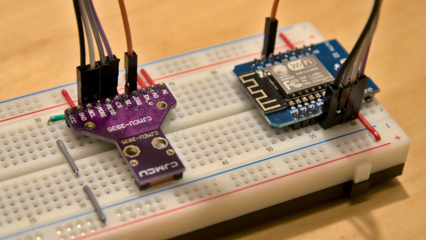

# Kaminari

This is an ESP8266 and AS3935 based Franklin Lightning Detector. It connects to a WiFi network, and offers a JSON web service for detected lightnings.

**WARNING: This project is for educational purposes only.** This is just a toy. It is not intended to be used as an early warning indicator for lightning related storms. It does not guarantee accuracy or predict exact strike locations. It it not a replacement for a professional lightning detector. Again: **This is just a toy.**

## Features

* Small size and low power consumption
* Can be read out and configured via HTTP web service and JSON
* Optional RGBW LED for showing the system status and detected lightnings
* Self-calibrating detector
* Permanent automatic noise floor level adjustment
* Comes with instructions for a pyramid shaped [3D printed case](case/README.md)

## Building and Installation



### Hardware

You need:

- An **ESP8266** module. You can use any brand, as long as it provides a regulated 3.3 V power source, and exposes the SPI interface and GPIO 5.
- An **AS3935** Franklin Lightning Detector module. Again, no special brand is required, as long as the SPI interface is exposed.

The lightning detector is connected like this:

- Vcc → 3.3 V power output of the ESP board
- SCL → CLK (IO14)
- MOSI → MOSI (IO13)
- MISO → MISO (IO12)
- CS → CS (IO15)
- IRQ → IO5

All other terminals of the detector are connected to GND of the ESP board.

Optionally, a single **SK6812** RGBW LED can be added as a status LED. It is must be powered by 5 V, and its data input is directly connected to IO4.

No other components are required.

To fully understand the functionality of the lightning detector, please read the [AS3935 datasheet](https://ams.com/documents/20143/36005/AS3935_DS000385_1-00.pdf).

Note that some boards that are available out there, are equipped with non-standard parts in the antenna RC. Those boards cannot be tuned to the recommended frequency of exactly 500 kHz, but only to a lower frequency, which however is still within the required tolerance. Kaminari tunes the antenna as close to 500 kHz as possible, but it is not a software fault if the exact frequency is missed.

Some manufacturers of the lightning detector print a calibration value on the package. As Kaminari calibrates the detector automatically, the calibration value is not used.

### Firmware

To build the firmware, you need to install the [Arduino IDE](https://www.arduino.cc/en/Main/Software). After installation, just open the `kaminari.ino` file.

### Dependencies

Please make sure these libraries are installed in the Library Manager of the Arduino IDE:

* [Arduino on ESP8266](https://github.com/esp8266/Arduino) (via Board Manager)
* [ArduinoJson](https://arduinojson.org/)
* [Adafruit NeoPixel](https://github.com/adafruit/Adafruit_NeoPixel)
* [EEPROM_Rotate](https://github.com/xoseperez/eeprom_rotate)

### Configuration

Before you build the project for the first time, please copy the `myWiFi.h.example` file to `myWiFi.h`, and adapt it to your needs:

- `MY_SSID`: The SSID of your WLAN to connect to
- `MY_PSK`: The password of your WLAN
- `MY_APIKEY`: Your API key for endpoint calls that change the state of the detector. You can set a random, password-like word here.
- `MY_MDNS_NAME`: Your preferred mDNS name. Just use the default value `kaminari` if you don't know what to use here.

### Installation

Now you can build the project in ArduinoIDE.

After that, connect your ESP8266 via USB. In the _Tools_ menu, please set all parameters so you can upload the sketch to your ESP8266. The settings depend on the brand of your module and on your computer's operating system, so there are no generic settings that can be recommended here.

When everything is completed, upload the sketch to your module. That's all.

You can open the _Serial Monitor_ to read some debug output of Kaminari as it starts up. You will find the WiFi status, the IP address, and the calibration results there.

### Connection

There is a small web server running in Kaminari. You can connect to it by pointing your browser to the IP address (e.g. http://192.168.1.23/status).

Kaminari uses mDNS. If your operating system supports it, you can also connect to the sensor via http://kaminari.local/status (or whatever mDNS name you have used in your `myWiFi.h` file).

## Endpoints

Kaminari offers a set of endpoints. Some endpoints are read-only. Other endpoints change the state of the detector, and thus require the API key to be passed in via `X-API-Key` header or `api_key` URL parameter. For the sake of simplicity, all requests are `GET` requests, even those that change the state of the detector.

### `/status`

Returns the current status of the detector as JSON structure. This is an example result:

```
{
    "lightnings": [
        {
            "age": 34,
            "distance": 12,
            "energy": 38123
        }
    ],
    "distance": null,
    "energy": 0,
    "noiseFloorLevel": 146,
    "disturberDetectedAge": 4241
}
```

This is the meaning of the individual properties:

- `lightnings`: An array of detected lightnings. It contains the `age` of the event (in seconds), the estimated `distance` of the lightning (in kilometers) and the lightning `energy` (no physical unit). Kaminari stores up to 16 lightning events, and returns them in antichronological order. When a 17th event is recorded, the oldest record will automatically be removed from the list. This array is empty if no lightnings have been detected yet.
- `distance`: General distance of the storm, in kilometers. `null` means that the storm is out of range, while `1` means that the storm is overhead. May also contain values caused by disturbers.
- `energy`: General energy of detected lightnings, with no physical unit. May also contain values caused by disturbers.
- `noiseFloorLevel`: Current noise floor level, in µVrms. Kaminari raises or lowers the level automatically, depending on the level of environment radio noises.
- `disturberDetectedAge`: Age of the latest detected disturber event, in seconds.

### `/settings`

Returns the current settings of the detector as JSON structure, for example:

```
{
    "tuning": 500135,
    "noiseFloorLevel": 146,
    "outdoorMode": false,
    "watchdogThreshold": 2,
    "minimumNumberOfLightning": 1,
    "spikeRejection": 2,
    "statusLed": true,
    "blueBrightness": 48
}
```

- `tuning`: The tuning of the internal antenna, in Hz. Should be around 500 kHz, with a tolerance of ±3.5%.
- `noiseFloorLevel`: Current noise floor level, in µVrms.
- `outdoorMode`: `true` if the detector is switched to outdoor mode. In outdoor mode, a higher noise floor level voltage is used for suppressing disturbers. If the LED is blinking blue, you can try to enable the outdoor mode to make the device less sensitive for disturbers.
- `watchdogThreshold`: Current watchdog threshold, see AS3935 datasheet.
- `minimumNumberOfLightning`: Minimum number of lightnings until a lightning detected event is triggered.
- `spikeRejection`: Current spike rejection, see AS3935 datasheet.
- `statusLed`: If `true`, the status LED displays signal quality and detected lightnings. If `false`, the status LED will only display important system states (WLAN disconnected, calibration in progress) and is turned off otherwise.
- `blueBrightness`: Maximum brightness of the blue LED indicating the noise floor level.

### `/update`

This endpoint permits to change the settings. Settings to be changed are passed as URL parameter:

- `outdoorMode`: Enable or disable the outdoor mode.
- `watchdogThreshold`: Watchdog threshold, between 0 and 10, see AS3935 datasheet. Higher numbers give better robustness against disturber signals, but a lower lightning detection rate.
- `minimumNumberOfLightning`: Minimum number of lightnings until a lightning detected event is triggered. Only 1, 5, 9, and 16 are permitted, other values will be ignored.
- `spikeRejection`: Spike rejection, between 0 and 11, see AS3935 datasheet. Higher numbers give better robustness against disturber signals, but a lower lightning detection rate.
- `statusLed`: Change the status LED operation.
- `blueBrightness`: Maximum brightness of the blue LED indicating the noise floor level, between 0 and 255. 0 turns the constant blue light off, while lightnings and system states are still indicated.

The changes are permanently stored and will still be effective after Kaminari had been powered off and on.

Other settings are managed by Kaminari and cannot be changed externally.

The API key is required for this call.

### `/calibrate`

This endpoint forces a new calibration of the internal oscillators. The calibration takes approximately 5 seconds. The calibrated antenna tuning is returned. It should be around 500 kHz.

The API key is required for this call.

### `/clear`

This endpoint clears the list of detected lightnings, and the age of the last detected disturber.

The API key is required for this call.

## Status LED

An optional RGBW LED is showing the current status of the device:

- **constant yellow**: The antenna is being calibrated. This takes approximately 5 seconds.
- **blinking red**: The WLAN connection is lost, and the device is currently trying to reconnect.
- **constant blue**: The device is in normal operation mode. The brightness of the blue color is an indicator for the current noise floor level. Darker blue indicates a lower noise floor level, which should be preferred. The maximum brightness can be changed via the `/update` endpoint.
- **blinking blue**: The maximum noise floor level has been reached. Background noise is too high. You should find a different place for your detector, or enable the outdoor mode. Try to keep it away from electronic devices, especially bluetooth devices, mobile phones or microwaves.
- **white flash**: A lightning has been detected.
- **fading red, yellow or green tints**: Indicates the estimated distance (color) and the intensity of the lightning (brightness). Green indicates that the storm is about 40 km away. Red indicates that the storm is overhead. The hue of other colors represent distances between.

## Data Recording

You can frequently poll the `/status` endpoint for lightnings and other sensor values. This can be done either manually or automated.

[Geordi](https://geordi.shredzone.org) is a tool that frequently polls the status and stores the samples in a Postgresql database. It supports Kaminari directly. [Grafana](https://grafana.com/) can be used for visualising the results.

## 3D Printed Case

As a contribution, there is a [3D printed case](case/README.md) included in this project. It's not an universal case, so you might have to modify it to your needs first.

## FAQ

- **Does this detector warn me in time if…**

  No.

  Seriously, this is just a toy, and only meant for experimenting and having fun. Never trust your life and other valuable stuff on it.

- **How can I test it?**

  Sadly, there is no better way than waiting for an actual thunderstorm.

  You can increase sensitivity by reducing `watchdogThreshold` and `spikeRejection`, and then try to simulate lightnings by switching a light switch. I could also simulate lightnings by using a bluetooth mouse close to the sensor.

- **I get a lot of false lightning events.**
  
  You can experiment with the `watchdogThreshold`, `spikeRejection` and `minimumNumberOfLightning` settings. There is not much more that can be done though.

- **Lightnings are not detected.**
  
  Your detector might be located in a place with too many radio noises. Try to find a different place, far away from radio sources (like smartphones or bluetooth devices). You can also try to reduce `watchdogThreshold`, `spikeRejection` or `minimumNumberOfLightning`.

  Lightnings are only detected in a radius of up to 40 km. However, lightnings are poorer detected with increasing distance.

- **Are kits or assembled devices available?**
  
  No, at least not that I am aware of.

## Contribute

* Fork the [Source code at GitHub](https://github.com/shred/kaminari). Feel free to send pull requests.
* Found a bug? [File a bug report!](https://github.com/shred/kaminari/issues) However, please don't file complaints about a poor accuracy or false detections. Remember that this is a toy and not a professional lightning detector.

## License

_Kaminari_ is open source software. The source code is distributed under the terms of [GNU General Public License (GPLv3)](https://www.gnu.org/licenses/gpl-3.0.en.html).
