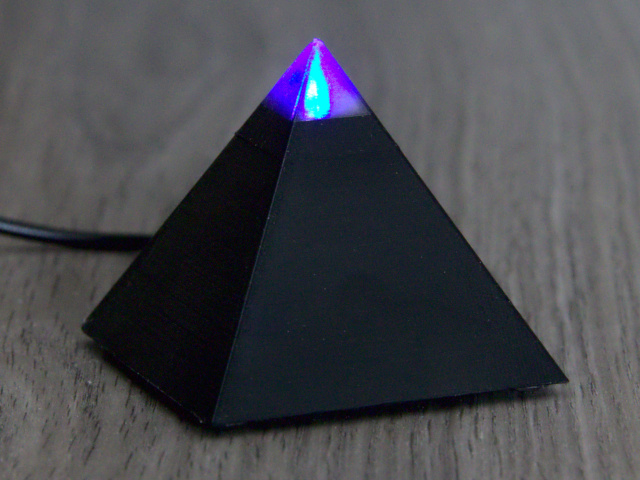

# Kaminari 3D Printed Pyramid Case

As a contribution, I have added a 3D printed, pyramid shaped case for the _Kaminari_ lightning detector.

It is designed with [OpenSCAD](https://www.openscad.org/). The source code is included, in case you have to make adjustments for your parts to fit.

The case is not weatherproof and meant to be used inside only.

## Bill of Material

This case is specially designed for these components:

* ESP8266: D1 Mini NodeMCU
* AS3935: CJMCU-3935 module
* SK6812: I used one that came on round breakout boards of 100 pcs.

These components should be available at online shops that sell electronic components from China.

Besides that, you also need:

* Some wires
* 6 wooden screws with flat heads, 3.0 x 12 mm
* 4 small, self-adhesive rubber feet
* filament in the color of your choice (a dark color is recommended to block the LED light)
* transparent filament ("natural" color)

## Preparation

There are five OpenSCAD files in this folder:

* `kaminari.scad`: This is the construction file itself. If you want to make changes to the construction, do it here. This file is not meant for printing though.

The other four files are rendering the single parts to be printed:

* `top.scad`: The **Pyramid Top**
* `base.scad`: The **Base Plate**
* `holder.scad`: The **LED Holder**
* `clip.scad`: The **H-Shaped Clip**

Render each file in OpenSCAD, and export it as stl file. You can then import the stl files in your printer's slicer software for printing.

## Printing

I have used black and transparent PETG for printing. PLA should do as well, but both filaments must be of the same material. Do not use metallic filament, as it might shield off radio waves.

All four parts should be printed in the original orientation. For best results, I recommend to print each part separately.

- **Pyramid Top**: 100% infill, brim is recommended. Supports are required at the four screw mounts, and recommended at the hole for the USB plug. Do not use supports for the pyramid tip. At 40 mm height, change to the transparent filament. Remove the supports and brim carefully after printing.

  If you cannot change the filament while printing, you can print this part entirely from transparent filament. You can also leave out the optional LED, and use an opaque filament.

- **Base Plate**: 30% infill, brim is recommended. No supports are required. Remove the brim carefully after printing.

- **LED Holder**: 30% infill, supports are required. Brim is not necessary unless there are warping issues. Remove the supports after printing, but there is no need to make it perfectly clean of burrs.

- **H-Shaped Clip**: 30% infill, supports are required. Brim is not recommended. Remove the supports carefully after printing.

## Assembly

* If not done already, connect the ESP8266 to your computer and flash the _Kaminari_ firmware.
* Solder wires to the LED board. Put the board on top of the LED holder, with the wires passing the hole. You can use a bit of glue if the LED board won't hold in its place properly.
* Use two screws to carefully mount the AS3935 to the bottom of the LED board. Do not overtighten the screws, to avoid damage to the board.
* Place the ESP8266 to the base plate, with the USB connector pointing outside, and the silver ESP8266 module pointing to the bottom.
* Use wires to connect the AS3935 and the LED board to the ESP8266 board. You can solder the wires to the boards directly, but I recommend to use pin headers. Keep the wires as short as possible, as there is not much space in the pyramid, but of course long enough so it can be assembled later.
* Check if the wiring is correct, then check again.
* Connect the ESP8266 to USB power. The LED should be yellow for a few seconds, and then blink red until WLAN connection is established.
* Disconnect the ESP8266 from USB.
* If everything is fine, use the _H-shaped clip_ to lock the ESP8266 in its place. Make sure the wires are routed below the horizontal _H_ bar of the clip.
* Now put the _LED holder_ on top of the construction. It all should resemble a pyramid shape now. The LED holder does not need to be fixed, because it will be held in place by the pyramid top.
* Carefully put the _pyramid top_ over the construction. It should fit nicely. If not, find the obstacle and remove it. **Make sure the hole for the USB plug is properly aligned to the USB connector.**
* Use the four remaining screws to fasten the pyramid top to the bottom plate.
* Stick the four rubber feet to the corners of the bottom plate.

That's all. You can now connect your Kaminari pyramid to an USB power source.

## License

_Kaminari_ is open source software. The source code is distributed under the terms of [GNU General Public License (GPLv3)](https://www.gnu.org/licenses/gpl-3.0.en.html).
